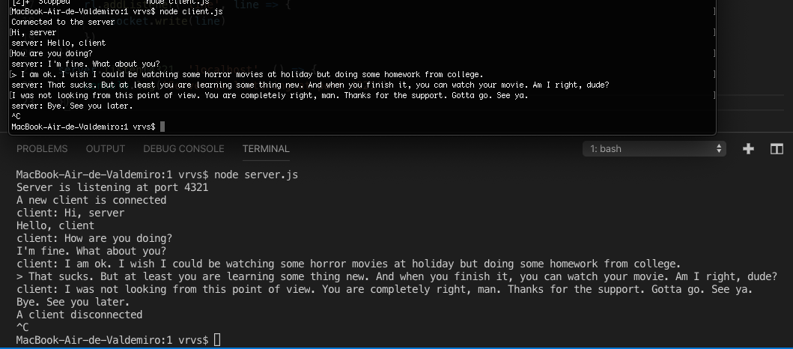
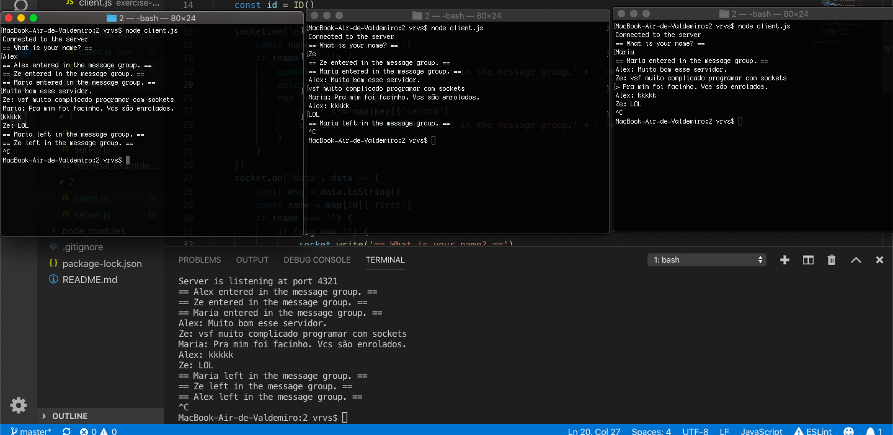
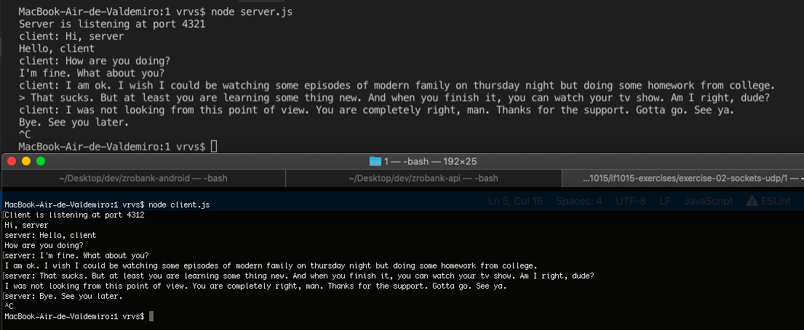
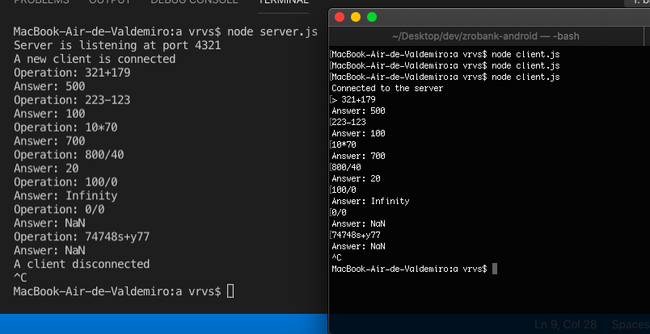
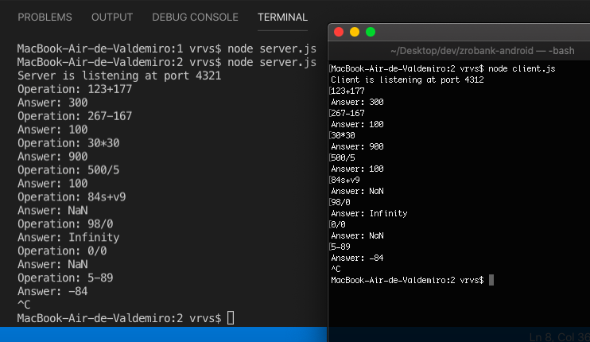

# Exercises - IF1015

### Exercise 1 - Sockets

##### Exercício

1. Semelhante ao exemplo do vídeo acima, crie uma aplicação console que funcionará como chat
ponto a ponto, onde um cliente utiliza socket para se conectar a um Servidor. Tanto no cliente como no servidor será possível digitar mensagens do chat a partir do console.

2. Baseado no exemplo anterior, crie uma nova versão para o chat, desta vez com suporte a conexão simultânea de vários clientes. Agora o servidor não necessita mais receber texto do console. Ele será apenas o mediador das mensagens entre os vários clientes conectados. Alguns requisitos:
     
    a. O servidor deve pedir ao usuário cliente para digitar um nome de modo que as mensagens de cada usuário possam ser identificadas.

    b. As mensagens enviadas por um cliente são replicadas para todos os outros clientes. Exemplo hipotético de conversação:
    
        Alex: Muito bom esse servidor.
        Ze: vsf muito complicado programar com sockets
        Maria: Pra mim foi facinho. Vcs são enrolados.
        Alex: kkkkk
        Ze: LOL

##### Perguntas para discussão
1. Quais as principais dificuldades?
2. Quais as principais diferenças entre a implementação da questão 1 e da questão 2?
3. Como gerenciar as conexões entre clientes na questão 2?
4. Como identificar as mensagens e os remetentes para seguir a formatação do exemplo?

### Exercise 2 - Sockets - UDP

##### Exercício

1. Semelhante ao exercício anterior com Sockets TCP, agora você utilizará sockets UDP1 para criar uma aplicação console que funcionará como chat ponto a ponto, onde um cliente se conecta a um Servidor e troca mensagens. Tanto no cliente como no servidor será possível digitar mensagens do chat a partir do console.

2. Considere um servidor que fornece um serviço de calculadora remota "avançada" que disponibiliza as operações artiméticas de adição, subtração, multiplicação e divisão. Os aplicativos clientes que utilizam o serviço devem se conectar e enviar dois inteiros como parâmetro, junto com o parâmetro indicando qual operação deve ser efetuada. O servidor devolve como resposta à aplicação cliente o resultado da operação. O cliente pode ser uma aplicação console que recebe os parâmetros e a operação através do terminal.
     
    a. Implemente o cliente e servidor em TCP

    b. Implemente o cliente e servidor em UDP

##### Perguntas para discussão
1. Quais as principais diferenças entre TCP e UDP?
2. Quais as principais diferenças entre a implementação TCP e UDP (tanto do chat como da calculadora)?
3. Quais as principais dificuldades nas implementações UDP?
4. Quando faz sentido usar TCP ou UDP?